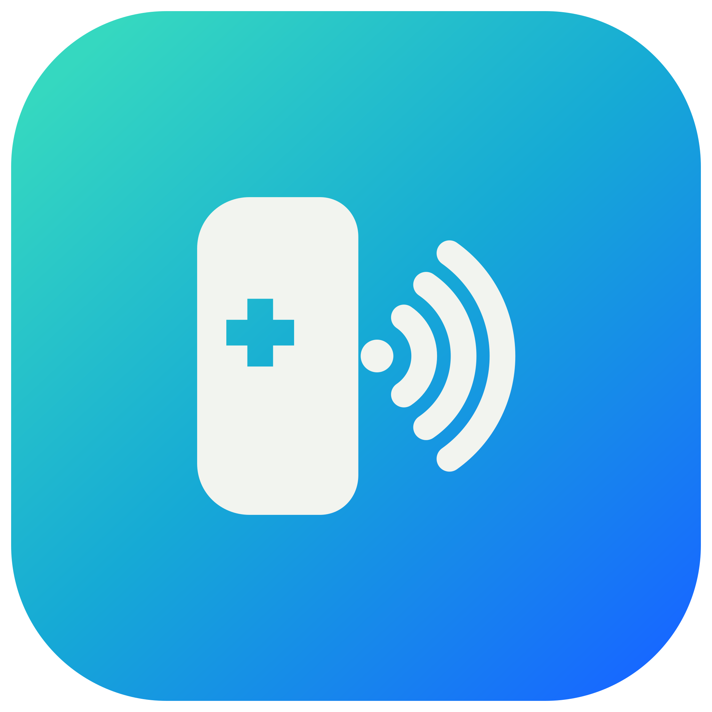
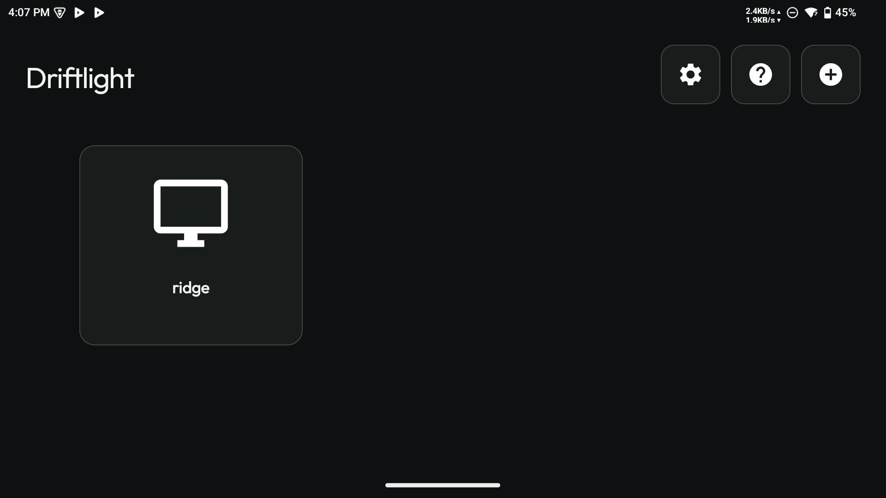
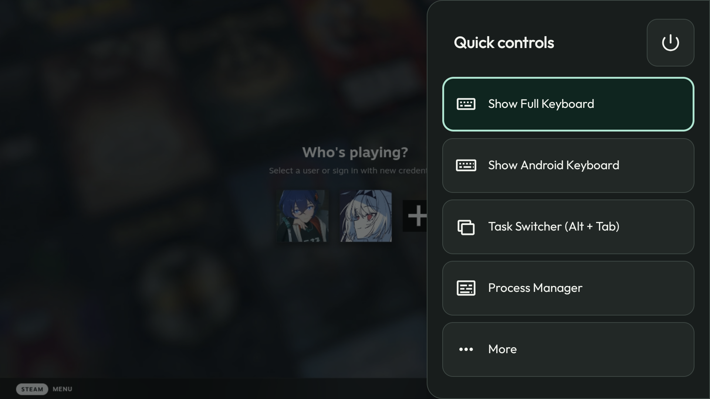
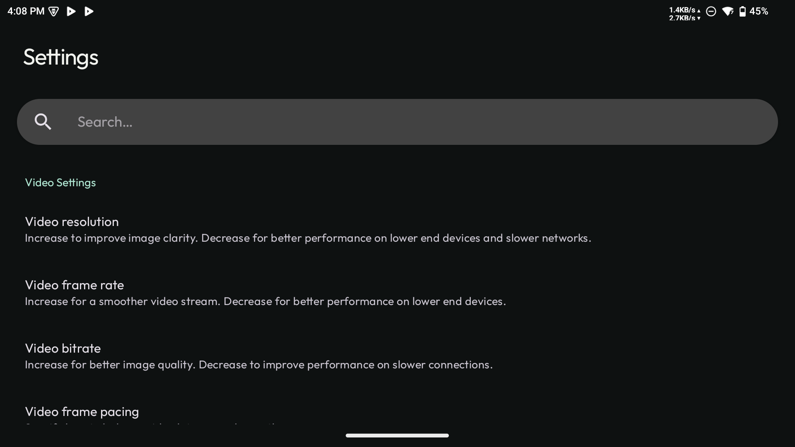
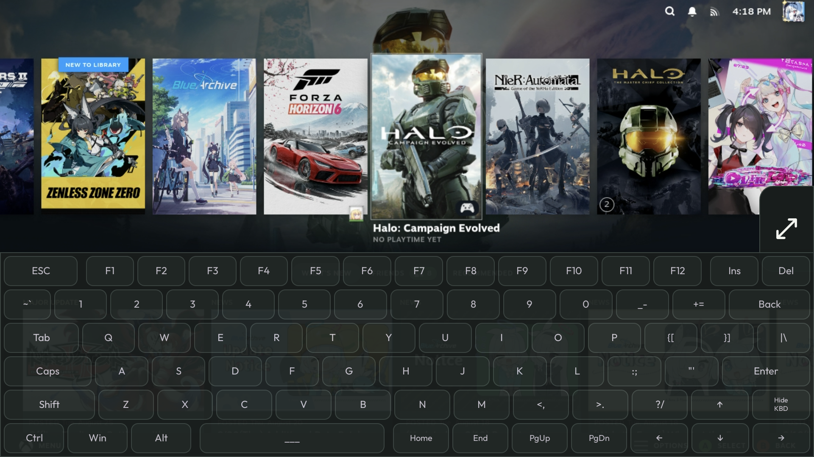

<p align="center">
  
</p>

<h1 align="center">Driftlight</h1>

<p align="center">
  A Moonlight Android fork with quick controls and a redesigned UI.
</p>

<p align="center">
  <a href="https://github.com/veedy-dev/driftlight-android/releases/latest"></a>
  <a href="https://github.com/veedy-dev/driftlight-android/actions/workflows/build.yml"></a>
  
  <a href="LICENSE.txt"></a>
</p>

<p align="center">
  <a href="https://github.com/veedy-dev/driftlight-android/releases/latest"><strong>Download the APK</strong></a>
  ·
  <a href="#build-from-source">Build from source</a>
  ·
  <a href="https://github.com/veedy-dev/driftlight-android/issues">Report an issue</a>
</p>

## About

Driftlight is a Moonlight Android fork with a new interface, quick controls, and desktop keyboard support.

## Features

- Updated host library and settings
- Quick controls inside the stream
- Full desktop and Android keyboards
- Touch, mouse, keyboard, and gamepad input
- Left or right quick-controls handle that fades away when idle; touch its edge position to reveal it
- Controller navigation in menus
- Moonshine and Apollo support
- Control-channel and FEC crash fixes

## Screenshots

| Host selection | Quick controls |
| --- | --- |
|  |  |

| Settings | Full desktop keyboard |
| --- | --- |
|  |  |

## Install

Download the APK from the [latest release](https://github.com/veedy-dev/driftlight-android/releases/latest) and open it on your Android device.

If Android blocks the installation, allow your browser or file manager to install unknown apps, then try again.

## Streaming servers

Install one of these on your computer:

- [Apollo](https://github.com/ClassicOldSong/Apollo)
- [Sunshine](https://github.com/LizardByte/Sunshine)
- [Moonshine for Linux](https://github.com/hgaiser/moonshine)

Open Driftlight and add the computer running the server.

## Build from source

You need JDK 17, Android SDK 35, and Android NDK `27.0.12077973`.

```bash
git clone --recurse-submodules https://github.com/veedy-dev/driftlight-android.git
cd driftlight-android
./gradlew assembleNonRoot_gameRelease
```

Gradle writes the unsigned release APK here:

```text
app/build/outputs/apk/nonRoot_game/release/app-nonRoot_game-release-unsigned.apk
```

For a development build that can sit beside the release app:

```bash
./gradlew assembleNonRoot_gameDebug
```

The Android NDK cannot build from a path containing spaces. Use a space-free checkout or the GitHub Actions workflow.

## Origin and license

Driftlight is based on Moonlight Android and [Artemis / Moonlight Noir](https://github.com/ClassicOldSong/moonlight-android). The upstream copyright notices and GPL-3.0 terms remain in place.

Driftlight uses [GPL-3.0](LICENSE.txt). The bundled fonts use the SIL Open Font License in [`store-assets/fonts`](store-assets/fonts).
