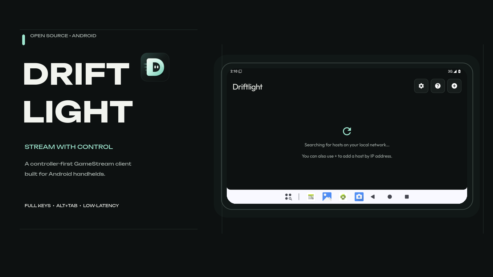
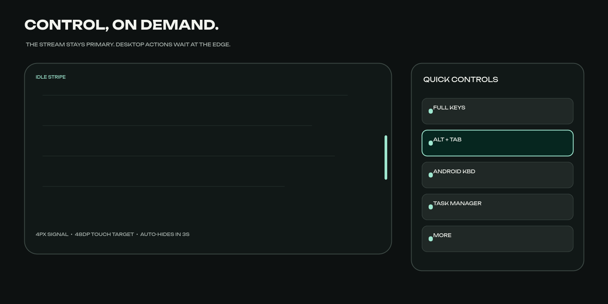
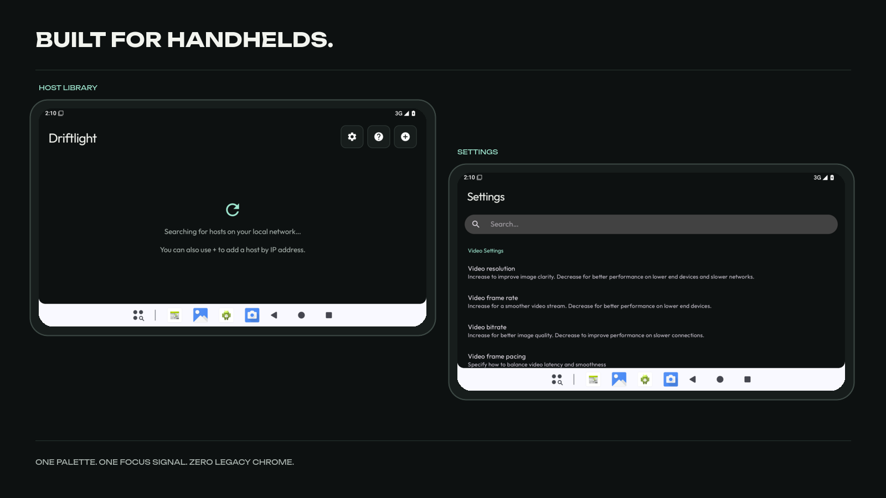

<p align="center">
  
</p>

<p align="center">
  <a href="https://github.com/veedy-dev/driftlight-android/actions/workflows/debug-build.yml"></a>
  
  
  <a href="LICENSE.txt"></a>
</p>

<p align="center">
  <strong>A controller-first, Moonlight-compatible client for Android handhelds.</strong><br>
  Desktop controls when you need them. Nothing over the game when you do not.
</p>

---

## Why Driftlight

Moonlight is excellent at streaming games. Handhelds also need the awkward desktop moments around those games: launchers, login fields, Alt+Tab, Task Manager, and full keyboard input.

Driftlight keeps the proven streaming core and builds those controls into the client without turning the stream into a dashboard.

<p align="center">
  
</p>

## What is different

| Streaming stays primary | Desktop control is one touch away |
| --- | --- |
| The floating handle fades into a transparent side stripe after three seconds. | Full keys, Alt+Tab, Android keyboard, Task Manager, and the extended menu. |
| Android system bars stay outside client content; streams enter real immersive fullscreen. | The complete desktop layout includes Esc, F1–F12, navigation, arrows, Win, Ctrl, Alt, and sticky modifiers. |
| An explicit control-channel keepalive protects Moonshine sessions from aggressive Android Wi-Fi power management. | Controller focus, 48dp targets, PiP restoration, clipboard sync, custom keys, and trackpad modes remain intact. |

## The client

<p align="center">
  
</p>

The interface uses one mineral-dark palette, one mint focus signal, and two authored typefaces: **Unbounded** for identity and **Outfit** for operational UI. The Drift Gate icon is hand-built SVG — no generated mascot art.

## Install

Download `Driftlight-android-debug` from the latest successful [GitHub Actions run](https://github.com/veedy-dev/driftlight-android/actions/workflows/debug-build.yml?query=branch%3Adriftlight), or use the APK attached to the latest release.

```bash
adb install -r app-nonRoot_game-debug.apk
```

Driftlight uses the application ID `com.veedy.driftlight.debug`, so it can live beside Moonlight and Artemis.

## Compatible hosts

- [Moonshine](https://github.com/hgaiser/moonshine)
- [Sunshine](https://github.com/LizardByte/Sunshine)
- [Apollo](https://github.com/ClassicOldSong/Apollo)
- Other Moonlight-compatible GameStream hosts

## Build

Requirements: JDK 17, Android SDK 35, Android NDK `27.0.12077973`.

```bash
git submodule update --init --recursive
./gradlew assembleNonRoot_gameDebug
```

The APK is written to:

```text
app/build/outputs/apk/nonRoot_game/debug/app-nonRoot_game-debug.apk
```

> The Android NDK cannot build from paths containing spaces. Use a space-free checkout or the included GitHub Actions workflow.

## Lineage

Driftlight stands on the work of [Moonlight Android](https://github.com/moonlight-stream/moonlight-android) and [Artemis / Moonlight Noir](https://github.com/ClassicOldSong/moonlight-android). Existing upstream copyright and GPL-3.0 terms remain in force.

Original Moonlight authors include Cameron Gutman, Diego Waxemberg, Aaron Neyer, and Andrew Hennessy.

Driftlight uses [Unbounded](store-assets/fonts/Unbounded-OFL.txt) and [Outfit](store-assets/fonts/Outfit-OFL.txt), distributed under the SIL Open Font License 1.1.
